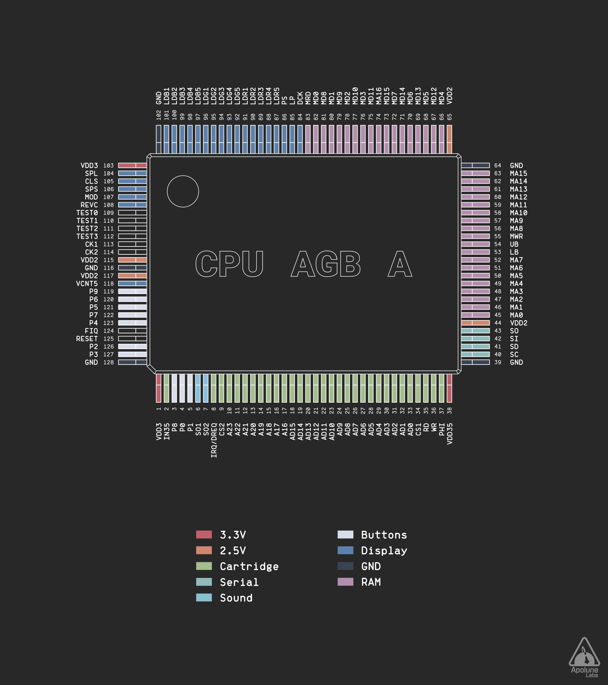
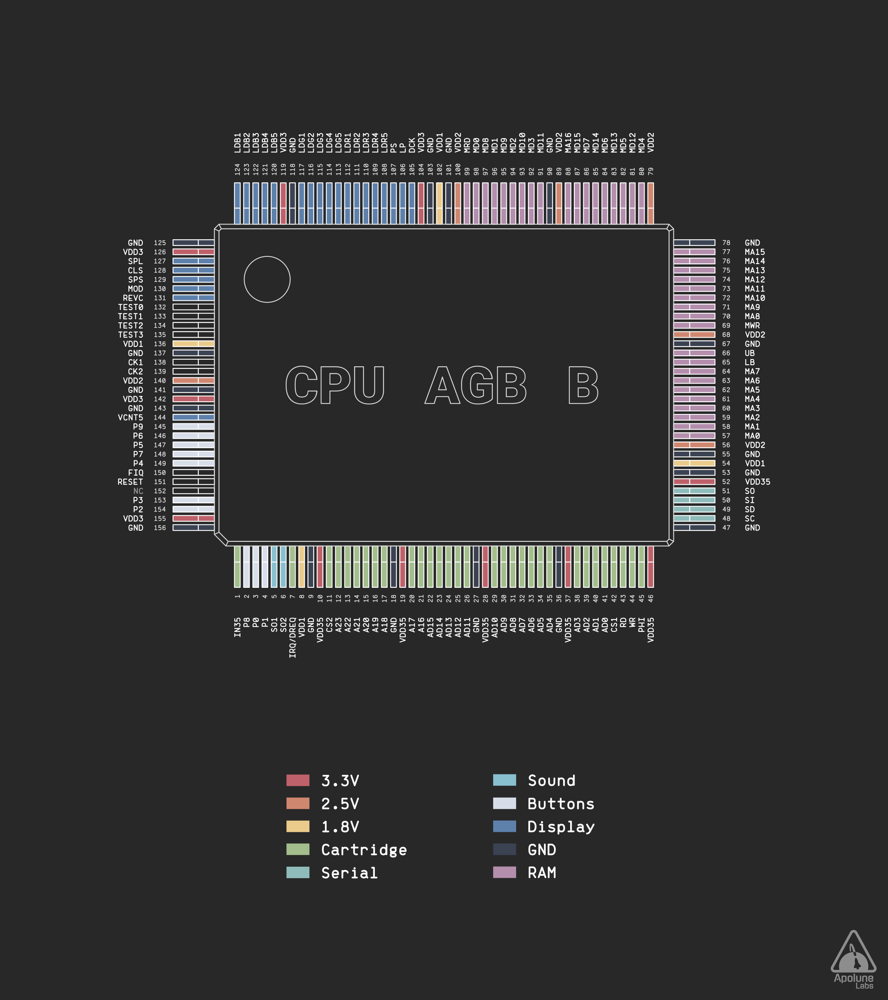
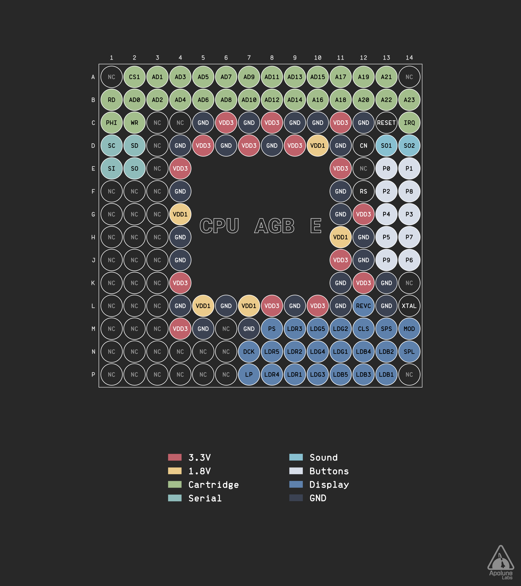

# Game Boy CPU Pinout Diagrams
This repository contains pinout diagrams of different Game Boy CPUs in `.svg` and `.png` format.

- [Game Boy CPU Pinout Diagrams](#game-boy-cpu-pinout-diagrams)
  - [License](#license)
  - [Editing the diagrams](#editing-the-diagrams)
  - [Game Boy Advance (series)](#game-boy-advance-series)
    - [CPU AGB A (Game Boy Advance, Game Boy Player)](#cpu-agb-a-game-boy-advance-game-boy-player)
    - [CPU AGB B (Game Boy Advance SP)](#cpu-agb-b-game-boy-advance-sp)
    - [CPU AGB E (Game Boy Micro)](#cpu-agb-e-game-boy-micro)
  - [Credits](#credits)

## License
This repository is licensed under Creative Commons Attribution-ShareAlike 4.0 International.

You can copy, share and modify the work for any purpose, even commercially, as long as appropriate credit is given to the original author and all derivative works are distributed under the same license. [Full license text](LICENSE)

## Editing the diagrams
To edit a diagram, open the `.svg` source file in the `src` directory with [Inkscape](https://inkscape.org). The diagrams were created with Inkscape version 1.4.2. The exported diagrams are located in `export/png` and `export/svg`.

## Game Boy Advance (series)
### CPU AGB A (Game Boy Advance, Game Boy Player)

<a href="export/png/CPU_AGB_A.png">PNG</a>
<a href="export/svg/CPU_AGB_A.svg">SVG</a>

### CPU AGB B (Game Boy Advance SP)

<a href="export/png/CPU_AGB_B.png">PNG</a>
<a href="export/svg/CPU_AGB_B.svg">SVG</a>

### CPU AGB E (Game Boy Micro)

<a href="export/png/CPU_AGB_E.png">PNG</a>
<a href="export/svg/CPU_AGB_E.svg">SVG</a>

## Credits
 - Font: https://github.com/fonsecapeter/brass_mono
 - Color palette: https://www.nordtheme.com/docs/colors-and-palettes
 - GBA schematic: https://github.com/nataliethenerd/AGB_ReverseEngineer/blob/main/gbaschematic.pdf
 - GBA SP schematic: https://github.com/Gekkio/gb-schematics/blob/main/AGS-CPU-11/schematic/AGS-CPU-11.pdf
 - Game Boy Micro schematic: https://github.com/HDR/Game_Boy_Micro_Schematic
